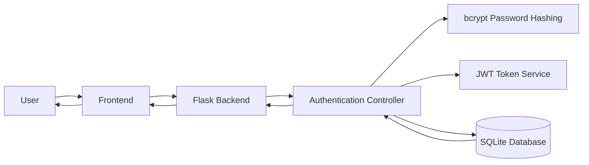
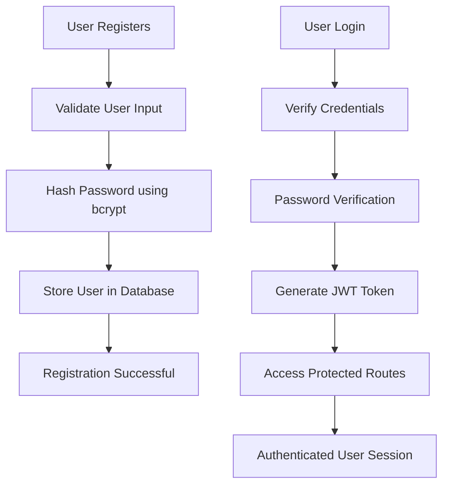

# Secure Login System

Secure Login System is a Flask-based authentication platform designed to provide secure user registration, login, and access control using modern authentication mechanisms. The application focuses on implementing industry-standard security practices such as password hashing, JSON Web Token (JWT) authentication, and role-based access control (RBAC).

The project demonstrates backend security fundamentals while providing a clean, modular architecture that can be extended into larger web applications.

This repository is organized to help recruiters and technical reviewers quickly understand the application's architecture, security implementation, and development workflow.

---

# At a Glance

- **Problem:** Traditional authentication systems often lack proper password protection and secure session management.
- **Solution:** Implement a secure authentication system using password hashing, JWT authentication, and protected API routes.
- **Outcome:** Provides a secure, scalable foundation for user authentication and authorization in modern web applications.

---

# What This Project Demonstrates

- Backend Development
- Secure Authentication
- Password Hashing
- JWT Authentication
- Role-Based Access Control (RBAC)
- REST API Development
- Database Integration
- Secure Session Management
- Flask Web Development
- Software Security Best Practices

---

# Core Features

- User Registration
- Secure Login
- Password Hashing using bcrypt
- JWT Token Generation
- Role-Based Authorization
- Protected Routes
- User Profile Management
- Secure Logout
- Session Validation
- Modular Flask Architecture

---

# System Architecture



---

# Authentication Workflow



---

# Authorization Flow

```mermaid
flowchart LR

User

-->

Login

-->

JWT Token

-->

Protected API

-->

Token Validation

-->

Authorized Request

-->

Application Response
```

---

# Tech Stack

## Frontend

- HTML5
- CSS3
- JavaScript

---

## Backend

- Python
- Flask

---

## Database

- SQLite

---

## Authentication

- JWT (JSON Web Token)
- bcrypt Password Hashing

---

## Security

- Password Encryption
- Session Validation
- Protected Routes
- Role-Based Access Control

---

## Development Tools

- Git
- GitHub
- Visual Studio Code
- Postman

---

# Repository Structure

```
Secure-Login-System/

│

├── models/

│   ├── user.py

│

├── routes/

│   ├── auth.py

│

├── templates/

│   ├── login.html

│   ├── register.html

│   ├── dashboard.html

│   ├── profile.html

│

├── static/

│   ├── css/

│   ├── js/

│

├── app.py

├── requirements.txt

├── README.md
```

---

# Authentication Modules

## User Registration

- User input validation
- Password hashing
- Database storage

---

## User Login

- Credential verification
- Password comparison
- JWT token generation

---

## Authorization

- Protected endpoints
- JWT verification
- User authentication
- Role validation

---

# Installation

## Clone Repository

```bash
git clone https://github.com/AnnElsaJoy-projects/secure-login-system.git

cd secure-login-system
```

---

## Create Virtual Environment

Windows

```bash
python -m venv venv

venv\Scripts\activate
```

Linux / Mac

```bash
python3 -m venv venv

source venv/bin/activate
```

---

## Install Dependencies

```bash
pip install -r requirements.txt
```

---

# Run the Application

```bash
python app.py
```

Flask Server

```
http://127.0.0.1:5000
```

---

# Usage

1. Register a new user account.
2. Log in using valid credentials.
3. Passwords are securely hashed before storage.
4. JWT tokens are generated after successful authentication.
5. Access protected routes using the generated token.
6. Manage user profile securely.

---

# Security Features

- Password hashing with bcrypt
- JWT-based authentication
- Protected API endpoints
- Role-Based Access Control (RBAC)
- Secure session management
- User input validation
- Authentication middleware
- Token verification

---

# Screenshots

## Login Page

(Add Screenshot Here)

---

## Registration Page

(Add Screenshot Here)

---

## Dashboard

(Add Screenshot Here)

---

# Suggested Review Path

If you're reviewing this project:

1. Read this README.

2. Inspect

```
app.py
```

to understand the application flow.

3. Review

```
models/user.py
```

for the user model.

4. Inspect

```
routes/auth.py
```

to understand authentication logic.

5. Explore

```
templates/
```

to review the user interface.

---

# Current Constraints

- Uses SQLite for local storage.
- Supports basic user authentication.
- No OAuth integration.
- No Multi-Factor Authentication (MFA).
- Email verification is not implemented.
- Password reset functionality is not available.

---

# Future Enhancements

- Google OAuth
- GitHub OAuth
- Multi-Factor Authentication (MFA)
- Email Verification
- Password Reset via Email
- Account Lockout Protection
- Refresh Tokens
- Login Activity Monitoring
- PostgreSQL/MySQL Support
- Docker Deployment

---

# Why This Project Is Interesting

Secure Login System demonstrates the implementation of modern authentication practices using Flask, JWT, and bcrypt. Rather than relying on plain-text password storage or insecure session handling, the project adopts industry-standard security techniques to protect user credentials and application resources.

The project showcases backend development, secure API design, authentication workflows, and software security best practices, making it an excellent portfolio project for software engineering, backend development, and cybersecurity roles.

---

# Author

**Ann Elsa Joy**

B.Tech Computer Science & Engineering

Mar Baselios Institute of Technology and Science (MBITS)

# License

This project is intended for educational and learning purposes.

© 2026 Ann Elsa Joy
